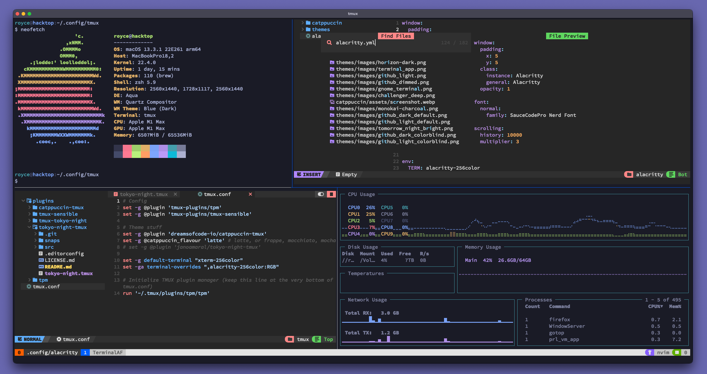

# TerminalAF
An unecessarily bright and intoxicatingly rad super dope setup for looking extra cool while you're doing terminal stuff on Zoom in front of other people ;)

# Dependencies (because I can't spell prerequesitsises...?)
In order to make your terminal look cooler than everybody elses, you're gonna need the following:

1.  because stock terminals are for babies
2. Some , I'm using tokyo-night
3.  because lots of smart people use it and you'll feel smarter if you use it
4. Tmux because I said so
5.  The Tmux Plugin Manager or  for short
6. , or whatever Neovim setup you prefer
7. A , I use SauceCodePro

You're also gonna need about 15 minutes to follow the preceeding setup guide because I'm just not cool enough to make a one-liner :(

# OSX setup
The image above was taken on a Mac, you should be able to produce something near identical using these instructions.

## Alacritty

## OhMyZsh

## Tmux

## Neovim with NvChad

## Nerd Font
