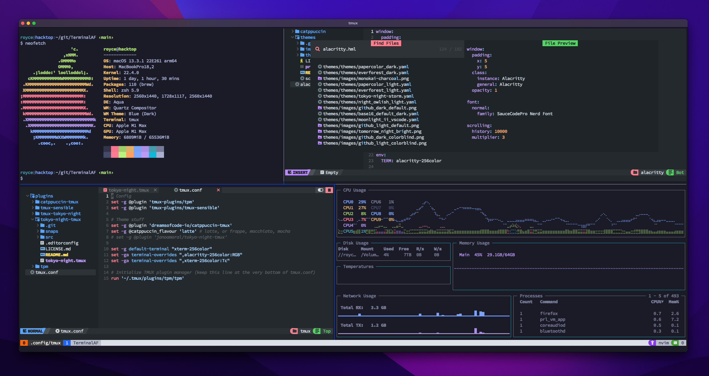

**Checkout my Discord:**

[](https://discord.gg/D5QTtWEwxZ)

# TerminalAF
An unnecessarily bright and intoxicatingly rad super dope setup for looking extra cool while you're doing terminal stuff on Zoom in front of other people ;)



# Dependencies (because I can't spell prerequesitsises...?)
In order to make your terminal look cooler than everybody elses, you're gonna need the following:

* [Alacritty](https://alacritty.org/) because stock terminals are for babies
* Some [Alacritty themes](https://github.com/alacritty/alacritty-theme), I'm using tokyo-night
* [Oh My ZSH](https://ohmyz.sh/) because lots of smart people use it and you'll feel smarter if you use it
* Tmux because I said so
*  The Tmux Plugin Manager or [tpm](https://github.com/tmux-plugins/tpm) for short
* [NvChad](https://nvchad.com/), or whatever Neovim setup you prefer
* A [Nerd Font](https://www.nerdfonts.com/font-downloads), I use SauceCodePro

You're also gonna need about 15 minutes to follow this setup guide because I'm just not cool enough to make a one-liner :(

# OSX setup
The image above was taken on a Mac, you should be able to produce something near identical using these instructions.

## Alacritty
1. Install Alacritty using the macOS binary from https://alacritty.org
2. Create the `~/.config/alacritty/` directory if it doesn't already exist
3. Follow [the instructions](https://github.com/alacritty/alacritty-theme) from the alacritty-theme git repo to create the `~/.config/alacritty/themes` directory and then clone the repo there
4. Finally, copy the `alacritty.yml` file from this repo to your `~/.config/alacritty/` directory


## OhMyZsh
1. Check out the one-liner from the Oh My ZSH [install](https://ohmyz.sh/#install) page.
2. Add the following somewhere in your `~/.zshrc`

```bash
export TERM="xterm-256color"
export PATH="$PATH:~/.config/nvim/bin"
export PATH="$PATH:$HOME/.tmux/plugins/tpm"
export PATH="$PATH:~/.config/nvim/bin"
alias vim="/opt/homebrew/bin/nvim"

alias nano="/opt/homebrew/bin/nvim" # lolol jk ;-) 
```

Optionally, you can choose from one of the prebuilt [themes](https://github.com/ohmyzsh/ohmyzsh/wiki/Themes).  I'm using [this one](https://github.com/win0err/aphrodite-terminal-theme).

## Tmux
1.  A simple `brew install tmux` should do the trick
2.  Follow these [installation](https://github.com/tmux-plugins/tpm) instructions for setting up tpm 
3.  Copy over the `tmux.conf` file from this repo to your `~/.config/tmux/` directory. Make sure to run `prefix` + `I` while in a tmux session to install the plugins.

## Neovim with NvChad
1. Install neovim using `brew install neovim`
2. Use this [one-liner](https://nvchad.com/docs/quickstart/install) to install NvChad which makes neovim extra awesome

NvChad comes with a bunch of different vim themes, I'm using `gitub_dark`.  You can pick a theme by pressing `leader` (Spacebar by default) + `t` and then `h`

## Nerd Font
1.  I found [this guide](https://www.geekbits.io/how-to-install-nerd-fonts-on-mac/) for using brew to install nerd fonts super helpful and easy 
2.  If you choose a different Nerd Font just make sure to update your `~/.config/alacritty/alacritty.yml` file


